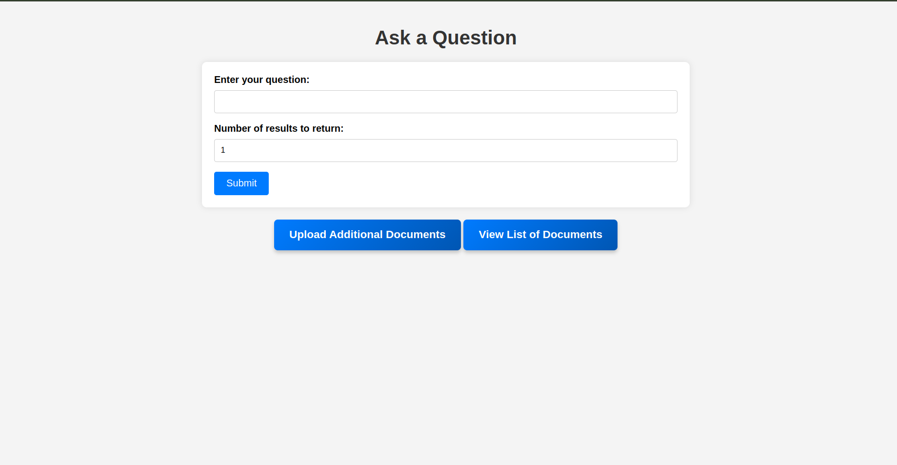

# django_search_engine

A simple search engine application built with Django that allows users to upload documents, process them, and query for similar documents based on their content.
Features

    Upload and store PDF, DOCX, and TXT documents.
    Preprocess and clean document content.
    Search for documents using a query and retrieve the most similar documents based on content.
    View and delete uploaded documents.

## Demo 
   

# Prerequisites

    Python 3.8+
    Django 4.0+
    nltk
    scikit-learn
    pandas
    PyPDF2
    python-docx

# Installation

## Clone the repository:

    bash

git clone https://github.com/yourusername/django-search-engine-app.git
cd django-search-engine-app

## Create a virtual environment and activate it:

bash

python -m venv env
source env/bin/activate  # On Windows use: env\Scripts\activate

## Install the required packages:

bash

pip install -r requirements.txt

## Download NLTK data:

In the Django shell, run:

python

import nltk
nltk.download('stopwords')
nltk.download('wordnet')
nltk.download('punkt')

## Apply database migrations:

bash 

python manage.py migrate

## Create a superuser (optional):

bash 

python manage.py createsuperuser

## Run the development server:
bash 

    python manage.py runserver

## Access the app:

    Open a web browser and go to http://127.0.0.1:8000/.

# Usage
## Upload Documents

    Navigate to the upload page at http://127.0.0.1:8000/upload/.
    Select and upload a document (PDF, DOCX, or TXT).

## Query Documents

    Navigate to the query page at http://127.0.0.1:8000/query/.
    Enter a search query and submit to find similar documents.

## View and Delete Documents

    Navigate to the document list page at http://127.0.0.1:8000/documents/ to view all uploaded documents.
    To delete a document, click on the delete option next to the document.

## File Overview

    views.py: Contains the core functionality for uploading, processing, querying, and deleting documents.
        preprocess_data: Cleans and preprocesses document text.
        upload_document_page: Renders the upload document page.
        upload_and_process_documents: Handles document upload and processing.
        query_page: Renders the query page.
        process_query: Processes the search query and returns similar documents.
        get_similar_articles: Calculates and returns similar documents based on the query.
        extract_text_from_pdf: Extracts text from PDF files.
        extract_text_from_docx: Extracts text from DOCX files.
        extract_text_from_txt: Extracts text from TXT files.
        delete_document: Deletes a document from the database.
        document_list: Displays a list of all documents.

## Contributing

Feel free to fork this repository and submit pull requests with improvements or fixes. Please ensure that you follow the existing code style and write tests for any new features.